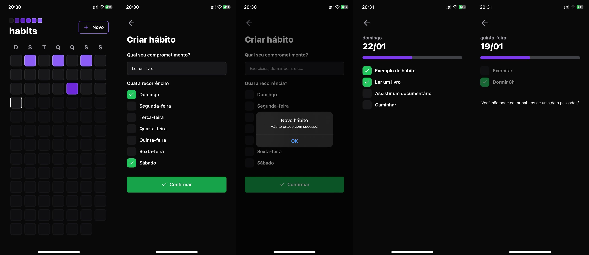
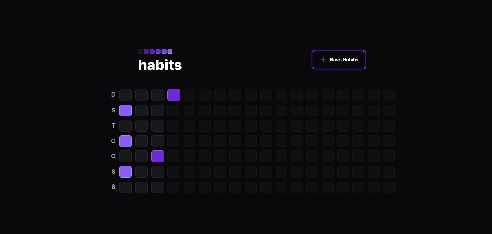
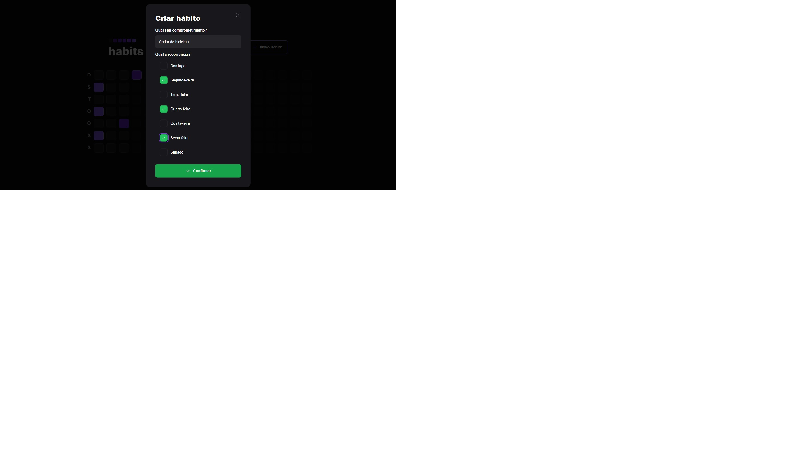

<h1 align="center"> NLW SETUP "Habits"</h1>

  <a href="#-tecnologias">Tecnologias</a>&nbsp;&nbsp;&nbsp;|&nbsp;&nbsp;&nbsp;
  <a href="#-projeto">Projeto</a>&nbsp;&nbsp;&nbsp;|&nbsp;&nbsp;&nbsp;
  <a href="#-layout">Layout</a>&nbsp;&nbsp;&nbsp;|&nbsp;&nbsp;&nbsp;
  <a href="#-contato">Contato</a>&nbsp;&nbsp;&nbsp;|&nbsp;&nbsp;&nbsp;
  <a href="#-licença">Licença</a>
  

  

 

  

---

  

---

  

---

  

## 🚀 Tecnologias

Esse projeto foi desenvolvido com as seguintes tecnologias:

- HTML
- CSS
- JavaScript
- TypeScript 
- React
- React Native
- Tailwind 
- Radix UI

## 💻 Projeto

Uma aplicação feita para o usuário controlar os hábitos (definidos por ele mesmo) em formato de meta durante os dias da semana. 

Esse projeto foi desenvolvido de ponta a ponta (front-end e back-end) tanto nas versões web quanto mobile, durante a semana NLW - Setup, um evento 100% gratuito promovido pela RocketSeat. 

## 🔖 Layout

No link abaixo você encontra o layout do projeto web e também do mobile. Lembrando que você precisa ter uma conta no [Figma](http://figma.com/) para acessá-lo.

- [Layout](https://www.figma.com/community/file/1195326661124171197)

## 📲 Contato 

Contate o desenvolvedor deste projeto através do link abaixo:

- [Linkedin](https://www.linkedin.com/in/raphael-da-silva-44a47114b/)

## Licença

Esse projeto está sob a licença MIT. Veja o arquivo [LICENSE](LICENSE.md) para mais detalhes.

---